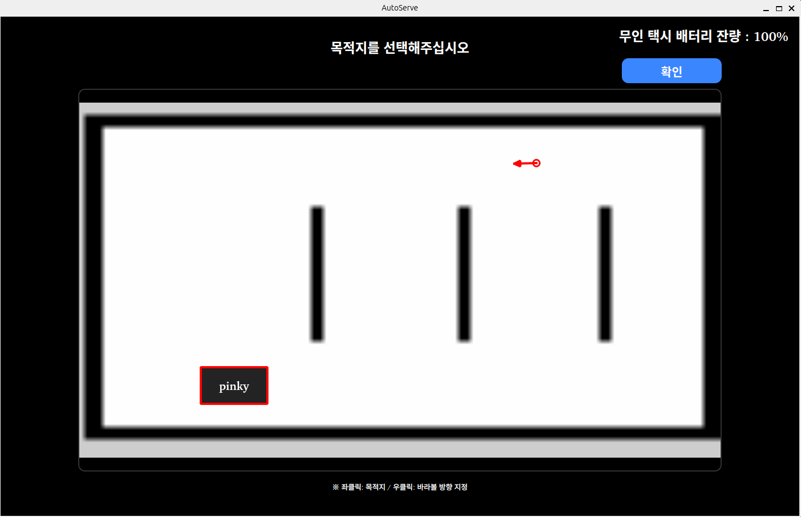
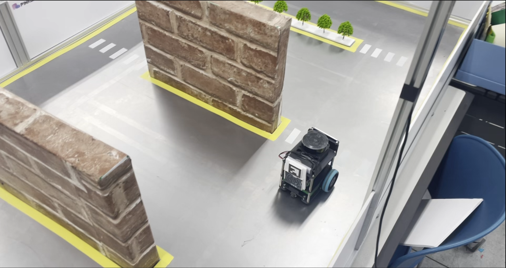

# roscamp-repo-2
ROS2와 AI를 활용한 자율주행 로봇개발자 부트캠프 2팀 저장소. ROS2 기반 자율 시스템 무인 택시 충전·운영 통합 플랫폼 (AutoServe)

<h1 align="center">🚖 TASHO</h1>

2-PRO 팀이 개발한, AI 기반 자율 시스템 무인 택시 충전·운영 통합 시스템입니다.

# 📌 프로젝트 개요 (Project Scenario)
본 프로젝트는 ROS 2를 기반으로 자율주행 무인 택시 시스템을 설계하고 구현하는 것을 목표로 한다. 본 시스템은 자율주행 이동 기능을 중심으로, 배터리 상태 인식과 자동 충전 기능을 통합하여 사람의 개입 없이 지속적으로 운용 가능한 무인 이동 플랫폼을 구현한다.
본 프로젝트에서는 자율주행 로봇, 로봇팔을 활용한 충전 시스템, 사용자 목적지 선택 인터페이스를 하나의 통합 구조로 구성하며, 이를 통해 실제 무인 택시 운영 환경을 가정한 시스템 구현 가능성을 검증하고자 한다.

- **프로젝트명**: TASHO
- **팀명**: 2-PRO
- **주제**: AI 기반 자율 시스템 무인 택시 충전·운영 통합 시스템
- **핵심 기술**: ROS2, YOLO, OpenCV, UDP, TCP, HTTP

# 👥 팀 구성 및 역할 (Team Roles)
|        | NAME | JOB |
|:------:|:----:|:----:|
| Leader  | 조건희 | 여기 작성 |
| Worker   | 김다준 | 여기 작성 |
| Worker   | 박건우 | 핑키 차선,사람,핑키차량 욜로 학습 및 인식 정확도 향상을 위한 로직을 개발,사용자 GUI 초기 툴 개발 |
| Worker   | 정현준 | 여기 작성 |
| Worker   | 최원준 | 여기 작성 |
| Worker   | 함주현 | 여기 작성 |

# ⚙️ 기술 스택 (Tech Stack)
- **Hardware Platform**:Raspberry Pi(PinkyBot, Jetcobot)
- **Development Environment**: Ubuntu(24.04) ROS2(Jazzy), OpenCV, YOLOv8, PyQt
- **Programming Languages**:Python, MySQL
- **Sensors & Perception Devices**LiDAR, Camera, IR Sensor
- **Communication Protocols**: TCP, UDP, HTTP
- **TOS2 Middleware & Messaging**: ROS2 Domain Bridge
- **Configuration Management**: Github, Jira, Confluence, Slack

# 📁 시스템 구성 (System Architecture)
## Hardware Architecture

## Software Architecture

## System Architecture

## Sequence Diagram

## Map

# 🛠 Implementation
## Scenario
### 시나리오 1 - 무인 택시 호출

### 시나리오 2 - 무인 택시 주행

### 시나리오 3 - 로봇팔 충전 
**조건:** 배터리 ≤ 30%

# 🎥 Demonstration Video
## 영상 제목
(영상)

# 📅 Project Schedule
Project Period: 2025.12.29~2026.02.27

(Jira 스케쥴)
